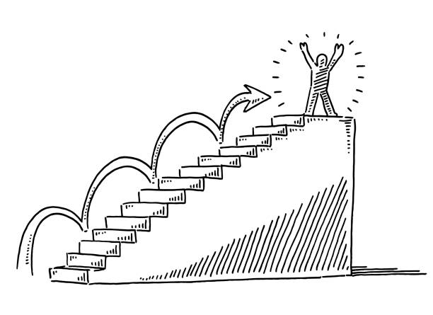

Through ICS 314, I have learned a lot of skills, especially soft skills. In the class, technical skills are not taught much, as I would usually learned that on my own, but this is a very fast-paced course, as I need to adapt to a new topic every week. It is a highly dense class with many deliverable aspects and was designed with the intention of utilizing AI during the process. As for a beginner like me, these technical skills that are demanded in the final project cannot simply be met just by manual coding. Since the "manual code" expectations for this course are low, I felt like I had not gained many technical skills, as the most I experienced was during the experience from the assignment I did at home, as I would not use AI to help me complete those.

I noticed that I have improved a lot as a person, teammate, and contributor throughout the semester, as I noticed my growth the most during the final project. Topics that are discussed in class, such as software engineering ethics and configuration management, are the most memorable for me.

**Configuration Management**

I really enjoy using GitHub throughout the semester and especially for the final project. To me, GitHub is like a security guard to the source code of the project. When you are visiting someone who lives in an apartment that has security guards, usually, you have to check in at the front desk first to check whether you are authorized to enter or not, and even sometimes, you have to write your information in a log so the system can keep track of the residents' visitors. In the same way, GitHub is in charge of version control of the source code, managing access, changes, and making sure that everything runs smoothly. At first, navigating through GitHub was a nightmare for me, but throughout the semester and definitely after the final project, I enjoy and see the importance of knowing how to use it effectively as a part of being a software engineer and a good contributor.

**Ethics in Software Engineering**

Throughout the semester's lectures, I often feel lost and confused (even with AI) since the topics were very advanced and would need a long time for me to grasp, but I really enjoy the debate on these topics. The debate was between two perspectives: Sara and the company she was working for. Sara is a software engineer with many years of experience and has contributed greatly to many projects, demonstrating her leadership and solid foundation skills. Charlie is also a software engineer who is fairly new compared to Sara, but one thing that stood out about Charlie is that he uses AI a lot in his work. Both Charlie and Sara applied for the position of Senior Software Engineer, but surprisingly, Charlie got the position. Sara and others were pretty surprised about the company's decision, as Charlie seems to lack competency and foundational and basic skills, such as GitHub, while working as Sara's manager. The debate was structured for the class to be divided into two teams, as one would advocate for Sara and the other would advocate for Charlie/the company's decision, with ethical reasons and evidence.

It was interesting to see the valid points that each team raised, and the most important part about this debate in modern times is that there is no clear answer. There should be no winning team in that debate since the given context was vague and those promotion decisions were determined based on not ethics in software engineering alone, but also the company, its value,... I am very curious about different ideas and opinions, since I realized that this scenario could happen to anyone nowadays. It also serves as a reminder for me to build a concrete foundation of knowledge, because despite the invention of new, advanced tools, in the end, I can only depend on my knowledge and experience, and that will help me stand out more compared to others who are heavily dependent on technologies they do not fully understand.

**Conclusion**

Even though the outcome of ICS 314 is not what I would have expected for an ICS class, I still value the growth I gained. I would constantly keep in mind these soft skills and mindset, since I am sure that they will help me improve as a team member, as they help me build a curious mindset with the momentum that can help me climb my way to success. Although I did not learn much about technical skills, I believe that those would come with time and with an improved and open mindset, they would come to me more easily and more naturally.

  

