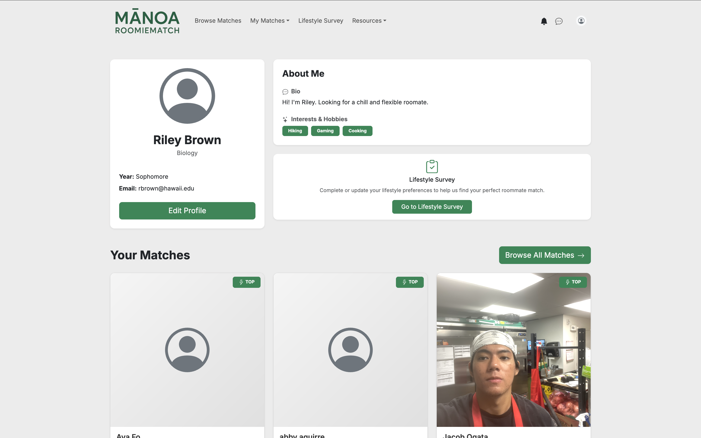
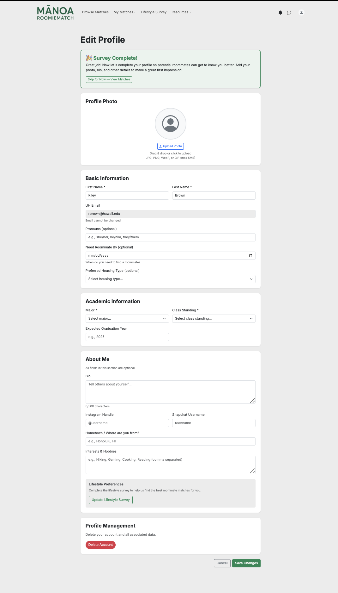

**Overview of Manoa RoomieMatch**

During ICS 314, one of my teammates came up with the idea of Manoa Roomie Match, a roommate matching website for UH Manoa students seeking a roommate. The goal of this website is to help students find their roommates based on their living preferences, lifestyle, and hobbies. Every student who signs up for an account would have to complete a set of questions about their habits, such as bedtime, noise, and social preference etc. After that, the new user would be directed to improve their public profile, containing their major, expected graduation date, a headshot of themselves, and any other personal information they wish to include. Students' survey answers will then be used to match them with others, as they could see more details about their match and even message their potential roommate. The website also provides other information about the dorms at UH Manoa for students to explore their living options or contact them in case they need help. Another role is Admin, who can oversee a list of users on their side of the website. Admin can manage all the users, from flagging users and inappropriate content to promoting someone to become another Admin, and all the lifestyle categories.

**My Contribution**

As a team member of Manoa RoomieMatch, I mainly worked on the users' "My Profile" and "Edit Profile" pages. The "Edit Profile" page writes directly to the database, while "My Profile" will load data from it. The "Edit Profile" page has many options for user to input their biography that can be seen by others, as well as upload their headshot and delete their account. On the "My Profile" page, I also implemented a section that shows the user's top 3 matches, which involves another member's API calling of the matching algorithm from the "Browse Match" page. The "Edit Profile" profile picture upload functionality is also an API call to the user's device for them to upload their photo.

### User Home Page

 

As shown, a user uploads his profile picture, and it can be seen by others who were matched with him.

### Edit Profile Page

 

In addition to these 2 pages, I also helped with little tasks such as rerouting and linking of the pages, modifying the "Sign Up" and "Sign In" pages, and setting up the database.

**My Takeaways**

Through this project, I was able to gain hands-on experience, from working with others to using AI to assist me. I also learned a lot about project management, communication, and planning skills, especially when it comes to organizing and linking the tables in the database. The project shows me that the work of a software engineer is not as simple as I thought, and that the work and its process are way more complicated than the name of the task/issue. Manoa RoomieMatch strengthened my knowledge of real-life web applications, as it not only taught me to think technically, but also to consider other aspects of users and future improvement.

More details on Manoa RoomieMatch's development process: 
- [Home Page](https://manoaroomiematch.github.io/)
- [Source Code](https://github.com/manoaroomiematch/manoaroomiematch)
